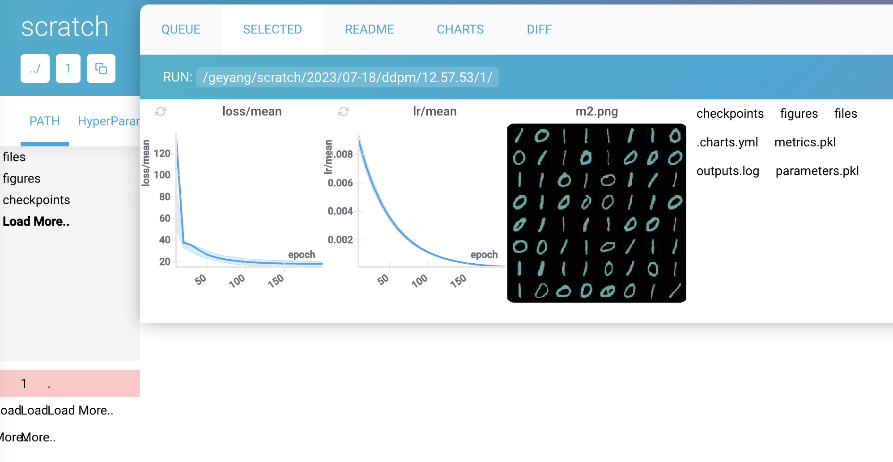

# Denoising Diffusion Probabilisitic Model

To Reproduce the results:
1. run the ddpm.py code. You need to have ML-Logger setup
2. click on the dashboard code that opens up.

You should see the images being generated, Each experiment should take about 10 minutes to run.

Here is an example: https://app.dash.ml/geyang/scratch/2023/07-18/ddpm/12.57.53/1

